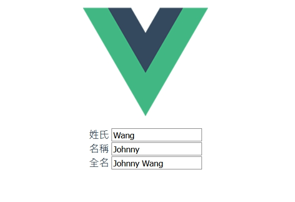

# Vue computed

<br>

computed 計算屬性存在的意義是當資料需要加工後呈現時使用，避免把資料加工邏輯寫在模板的 `{{ }}` 裡面，保持乾淨清爽。

除此之外，computed 還有緩存的觀念，這個本篇後面提到。

<br>

## 示例

* 做一個簡單的打招呼功能吧 :

    ```html
    <template>
    <div>
        <div>
          <label>姓名</label>
          <input type="text" v-model="name"/>
        </div>

        <div>
          <label>課程</label>
          <input type="text" v-model="course"/>
        </div>

        <div>
          {{message}}
          <button type="button" @click="sayHello">btn</button>
        </div>
    </div>
    </template>

    <script>
    export default {
    data() {
        return {
          name: '',
          course: '',
      };
    },

    methods:{
        sayHello(){
            return "hello" + this.name
        }
    },

    computed:{
        message(){
        var msg = `welcome to ${this.course} Mr/Ms. ${this.name}` 
        return msg
        }
      }
    };
    </script>
    ```

    可以看到，我們的 vue 物件多出了一個 `computed` 區塊，添加了 `message()` 方法。
    
    `message()` 裡面用到了 `course` 與 `name` 這兩個屬性，所以我們可以說，`message()` 依賴於 `course` 與 `name`。當這種依賴產生，`course` 與 `name` 變動時，`message()` 就會跟著動。有點類次於監聽器。

    <br>

    那就有人會說了，`message` 不就是寫了一個 func 再 `methods` 區塊中嗎 ? 像這樣 : 

    ```html
    <template>
        <div>{{ message() }}</div>
    </template>

    <script>
    export default {
    data() {
        return {
          name: "",
          course: ""
      };
    },
    methods:{
        message(){
        var msg = `welcome to ${this.course} Mr/Ms. ${this.name}`;
        return msg;
        }
      },
    };
    </script>
    ```

    在畫面上看起來，確實是實現了一樣的功能，但是實際上的原理不一樣。

    <strong>重點 ! : </strong>不管是寫在 `methods{}` 或者是 `computed{}` 內。我們都可以用 `this.message()` 來取用 `message` 的值，但是寫在 `methods{}` 裡面的話，每呼叫一次就要重新計算一次值。而寫在 `computed{}` 裡面就不一樣，除非 `this.name` 或 `this.course` 的值改變，否則計算過一次之後便會把值緩存起來，每次呼叫就取用原來的，不必重複計算。

    <br>
    <br>

  ## computed 裡的 setter 與 getter

  * `computed` 屬性預設只有 getter 方法，需要時可以自己定義 setter。

    ```html
    <template>
      <div>
        <div>
          <label>姓氏</label>
          <input type="text" v-model="lastname" />
        </div>

        <div>
          <label>名稱</label>
          <input type="text" v-model="firstname" />
        </div>

        <div>
          <label>全名</label>
          <input type="text" v-model="fullname" />
        </div>
      </div>
    </template>

    <script>
    export default {
      data () {
        return {
          firstname: '',
          lastname: ''
        }
      },
      computed: {
        fullname: {
          get () {
            return `${this.firstname} ${this.lastname}`
          },
          set (val) {
            var names = val.split(' ')
            this.firstname = names[0]
            this.lastname = names[names.length - 1]
          }
        }
      }
    }
    </script>
    ```
    直接貼上這區塊 code，在任何欄位上改動資料，都會有即時響應。

    


