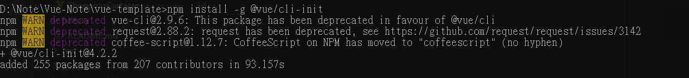
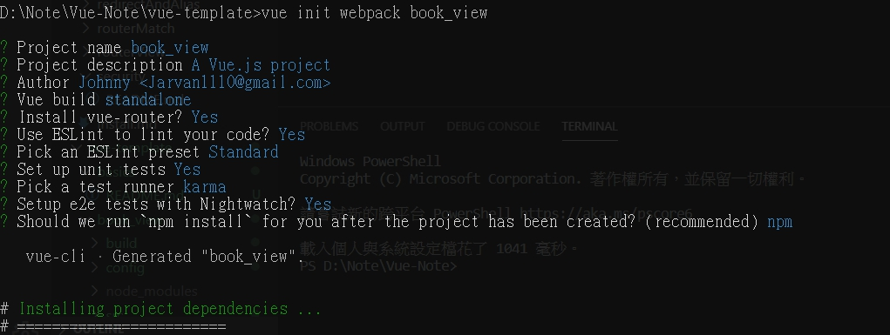

# 開始使用 vue-cli

<br>

關於 Node.js 與 npm 就不多做解釋了，直接去 Node.js 官網下載安裝即可，使用 vue-cli 必備。

<br>

## 安裝 vue init

* 確認 node.js 安裝完成後，直接開啟終端機執行以下片段 : 

    ```bash
    npm install -g @vue/cli-init
    ```

* 執行後 console 如下 : 

    

    這樣一來就安裝好 vue init 了， `-g` 參數是指全域使用範圍安裝。

<br>
<br>

## 開始使用 vue-cli

* 安裝好全域的 vue init 套件後，在終端機如下輸入 :

    ```bash
    vue init webpack project-name
    ```

* 執行此期間，會詢問使用者一些基本的配置信息，一般情況下可以如下配置 ：

    

    這樣一來就成功初始化了一個完整的 vue-cli 專案，可以直接 cd 到專案資料夾下，啟動 webpack :
    ```bash
    npm run dev
    ```
    <br>

