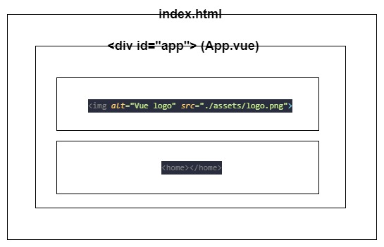
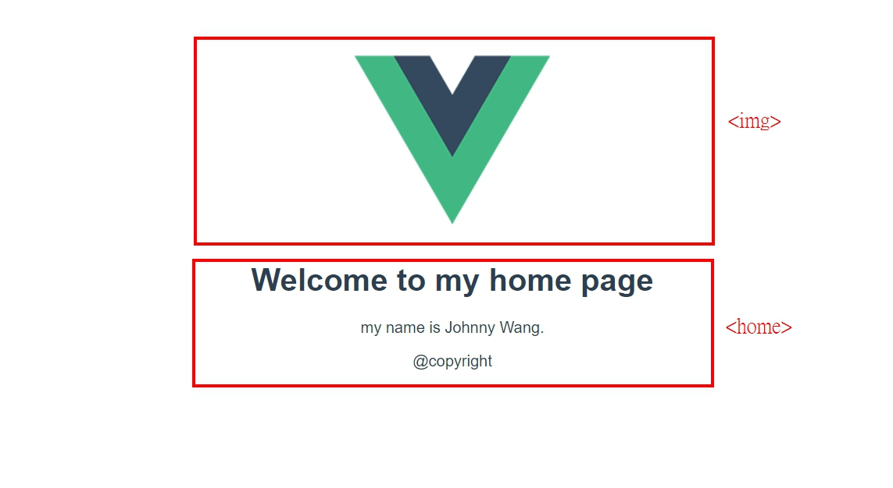
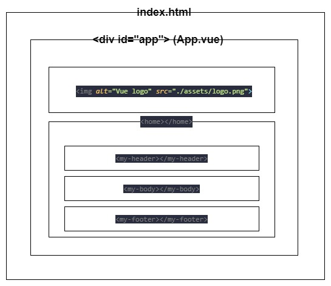
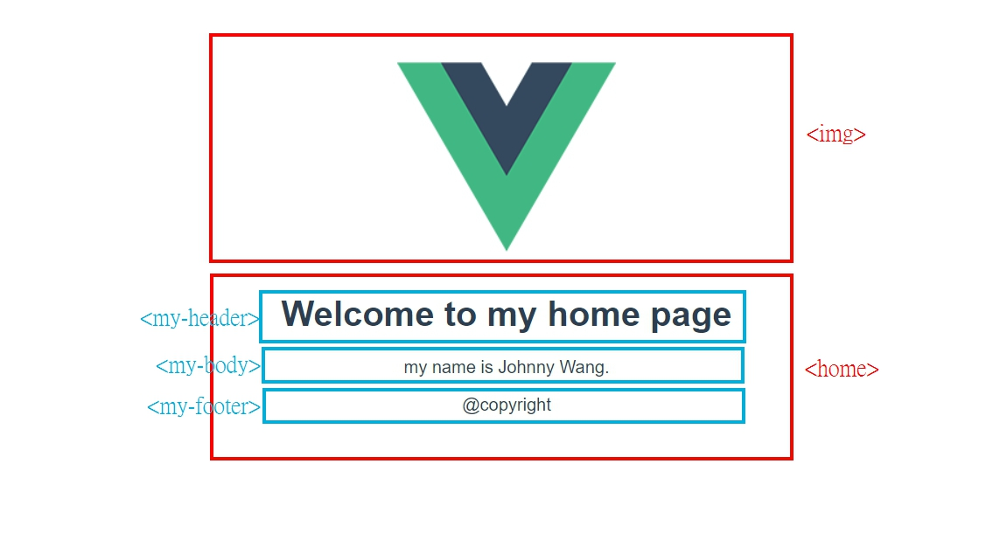
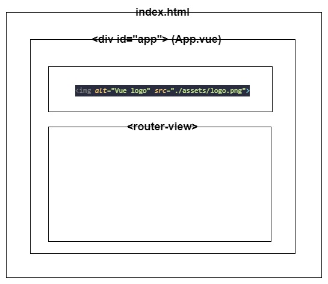
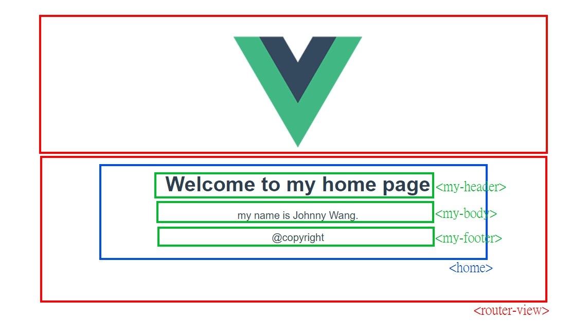

# 一個合理的架構應該是 ? 

<br>

前面講了那麼多，到了真正要做專案時，要如何使用 `router` 跟 `components` 呢 ? 

其實，這並沒有一個百分之一百的規則，只是在寫網頁模板開發的歷史上，已經出現過一些開發架構與規範，這邊就整理一個比較合理化的架構來說明，到底要怎樣合理的使用 `router` 跟 `components`。

<br>

---

<br>

## 基本觀念

首先，需要說明一下閱讀本章節需要的一些基本觀念。

<br>

### 一、 `component` 的使用

* 前面提到過很多次 : 任何一個 `.vue` 文件都是 `component`，那我們可以認為一個 `component` 就代表一個頁面嗎？答案是不一定，在一般情況下，是可以把一個 `compoent` 當成一個單獨頁面來認定，在不考路 `router` 的情況下，我們可以這樣嘗試 :

    * 建立一個元件 :  `Home.vue` 如下 :

        src/components/Home.vue

        ```html
        <template>
            <div>
                            <!-- 頭 -->
                <div>
                    <h1>Welcome to my home page</h1>
                </div>
                
                            <!-- 身體 -->
                <div>
                    <article>
                        <p>my name is Johnny Wang.</p>
                    </article>
                </div>
                
                            <!-- 尾巴 -->
                <div>
                    <footer>@copyright</footer>
                </div>
            </div>
        </template>
        ```

        <br>


    * 修改主應用元件 : `App.vue` 如下 : 

        ```html
        <template>
            <div id="app">
                
                <home></home>
            </div>
        </template>

        <script>
        import Home from "@/pages/Home";
        export default {
            name: 'App',
            components: {
                Home
            }
        }
        </script>
        ```

        <br>

        用圖像來理解一下目前架構 :

        

        <br>

        實際畫面長這樣 :

        

        <br>

    以上就是 `vue-component` 的起手式。

    <br>
    <br>

### 二、 `page` 與 `components`

* 事實上，vue 官方並沒有明確定義出有 `page` 的這一個概念，只是經過長時間的實作，業界整理出的一種架構：`page` 是由一個以上的 `component` 組合而成的獨立頁面。

* 像我們上面實作的 `Home.vue` 元件，其包括了頭、身體、尾巴這三個部分，可能不只有 `Home.vue` 要使用頭跟身體，以後其他元件也可能需要有一個一模一樣的頭與尾巴部分。所以我們要做的就是把 `Home.vue` 先拆分，再重組 :

    * 建立 `MyHeader.vue` 元件：

        src/components/MyHeader.vue

        ```html
        <template>
            <div>
                <h1>Welcome to my home page</h1>
            </div>
        </template>

        <script>
            export default {
                name: "MyHeader"
            }
        </script>
        ```

        <br>

    * 建立 `MyBody.vue` 元件：

        src/components/MyBody.vue

        ```html
        <template>
            <div>
                <article>
                    <p>my name is Johnny Wang.</p>
                </article>
            </div>
        </template>

        <script>
            export default {
                name: "MyBody"
            }
        </script>
        ```

        <br>

    * 建立 `MyFooter.vue` 元件：

        src/components/MyFooter.vue

        ```html
        <template>
            <div>
                <footer>@copyright</footer>
            </div>
        </template>

        <script>
            export default {
                name: "MyFooter"
            }
        </script>
        ```

    <br>

    ---

    其實仔細一看就可以知道，我們只不過是把 `Home.vue` 整體的三個部分拆成 3 個不同元件而已。

    ---

    <br>

    * 建立 page : `Home.vue`

        src/pages/Home.vue

        ```html
        <template>
            <div>
                <my-header></my-header>
                <my-body></my-body>
                <my-footer></my-footer>
            </div>
        </template>

        <script>
            import MyHeader from "@/components/MyHeader";
            import MyBody from "@/components/MyBody";
            import MyFooter from "@/components/MyFooter";

            export default {
                name: "Home",
                components:{
                    MyHeader, MyBody, MyFooter
                }
            }
        </script>
        ```

        <br>

    * 現在來看看架構圖 :

        

    <br>

    * 再來看看實際如何 :

        


    <br>

    以上就是如何使用 `page` 的觀念管理 `component`。

<br><br>
<br><br>

---

<br>
<br>

## `page` 整合 `router`

實際上，在了解了上面的基本觀念之後，剩下的就基本沒什麼了，只需要把 `page` 當成前面幾個章節我們使用的 `component` 來看待就好了。

<br>

* 修改主應用元件 : `App.vue` 如下 : 

    src/App.vue

    ```html
    <template>
        <div id="app">
            
            <router-view></router-view>
        </div>
    </template>

    <script>
    export default {
        name: 'App'
    }
    </script>
    ```

    <br>

* 建立 `router` 管理檔案 : `index.js`

    src/router/index.js

    ```js
    import VueRouter from "vue-router";
    import Vue from 'vue'
    import Home from "@/pages/Home";

    Vue.use(VueRouter)

    export default new VueRouter({
        routes: [
            {
                path: '/',
                component: Home,
            }
        ]
    })
    ```

    <br>

* 最後在 `main.js` 裡做一下 `router` 的註冊 :

    src/main.js

    ```js
    import Vue from 'vue'
    import App from './App.vue'
    import router from '@/router/index'

    Vue.config.productionTip = false

    new Vue({
    router,
    render: h => h(App),
    }).$mount('#app')
    ```

    <br>

* 目前看起來的架構是這樣 : 

    

    <br>

* `<router-view>` 裡面的內容就是由 `index.js` 來控管拉，像是我們在 `index.js` 裡面設定的默認路徑 ： `"/"`，就是由 `Home.vue` 這個原件來呈現，所以我們瀏覽器路徑切換到 `"/"` 時就可以看到如下畫面 :

    

<br>
<br>

---

<br>
<br>

以上就是本章所有內容。