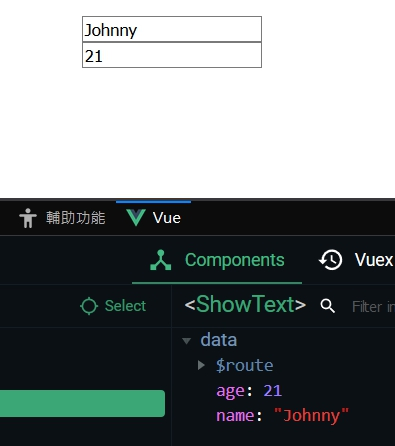
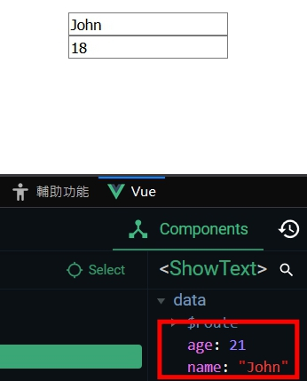

# v-model

<br>

為甚麼 `v-model` 要單獨拿出來做筆記呢 ? 因為最早我一直把 `v-model` 跟 `v-bind` 搞混，功能看似一樣，但是實際上運用的地方完全不一樣。

`v-model` 的功能就是它的名面上的意思，使用作為資料 model 的綁定，`v-bind` 是作為視圖資料的綁定，簡單說就是一進一出的觀念，`v-model` 是把資料往後台送，`v-bind` 是把資料從後台網前端送。 

<br>

## 範例

* `v-model` 是資料的雙向綁定，`v-bind` 則沒有這種功能。

```html
<template>
  <div>
    <input type="text" v-model="name"/>
    <br/>
    <input type="text" :value="age"/>
  </div>
</template>

    <script>
export default {
  data(){
    return{
      name: 'Johnny',
      age: 21,
    }
  }
};
</script>
```

實際上看到，name 與 age 分別為 'Johnny' 與 21 :



我們分別改動一下兩個 input 看看結果 :



name 因為是用 `v-model` 綁定的，所以資料會動態更新，而 age 是用 `v-bind` 綁定的，資料不會隨時更新。

<br>

## 補充

`v-model` 基本都是跟 `<input>` 同時使用的，所以可以配合各種類型 `<input>` 使用， select options、checkbox、radio 等等。

  這邊就不一一做說明了，直接看範例 code : 

* Checkbox

  ```html
  <input type="checkbox" id="checkbox" v-model="checked">
  <label for="checkbox">{{ checked }}</label>
  ```

  <br>

* Multiple Checkboxes 塞在同一陣列 :

  ```html
  <template>
    <div>
      <div id="example-3">
        <input type="checkbox" id="jack" value="Jack" v-model="checkedNames" />
        <label for="jack">Jack</label>
        <input type="checkbox" id="john" value="John" v-model="checkedNames" />
        <label for="john">John</label>
        <input type="checkbox" id="mike" value="Mike" v-model="checkedNames" />
        <label for="mike">Mike</label>
        <br />
        <span>Checked names: {{ checkedNames }}</span>
      </div>
    </div>
  </template>

      <script>
  export default {
    data() {
      return {
        checkedNames: []
      };
    }
  };
  </script>
  ```
  效果 : 
  

  <br>

* Radio

  ```html
  <template>
    <div>
      <input type="radio" id="one" value="One" v-model="picked" />
      <label for="one">One</label>
      <br />
      <input type="radio" id="two" value="Two" v-model="picked" />
      <label for="two">Two</label>
      <br />
      <span>Picked: {{ picked }}</span>
    </div>
  </template>

      <script>
  export default {
    data() {
      return {
        picked: null
      };
    }
  };
  </script>
  ```
  效果 :
  

  <br>

* Select

  ```html
  <template>
    <div>
      <label>選甚麼呢 ?</label>
      <select v-model="selected">
        <option v-for="option in options" :key="option.value" :value="option.value">{{ option.text }}</option>
      </select>
      <h3>{{ selected }}</h3>
    </div>
  </template>

      <script>
  export default {
    data() {
      return {
        selected: null,
        options: [
          { text: "One", value: "A" },
          { text: "Two", value: "B" },
          { text: "Three", value: "C" }
        ]
      };
    }
  };
  </script>  
  ```

  效果 :

  

<br>

---

<br>

完整範例教學請參閱官方文件 : [傳送門](https://vuejs.org/v2/guide/forms.html)


