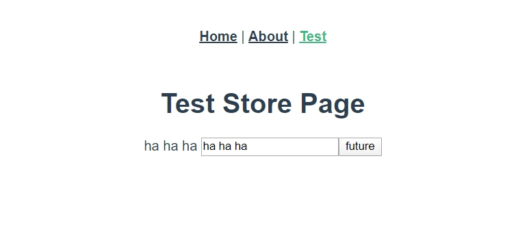

# 更好的設計與使用 actions

<br>

承接上一章，接下來要說明一下進階一點的 actions 用法了。

<br>

## `mapActions`

* 在上一個章節中，我們示範了如何製作與使用基本的 actions。在 components 中 actions 的使用方式如下 : 

    ```js
    this.$store.dispatch("changeMsg", "new msg")
    ```

    當我們要大量使用 actions 時，可以使用 `mapActions` 輔助函式將 components 的 methods 映射為 `store.dispatch` 來幫我們快速開發。

    ```html
    <template>
        ...
    </template>

    <script>
        import {mapActions} from 'vuex'  // import mapActions

        export default {
            
            ...

            methods: {
                ...mapActions([
                    "changeMsg"
                ])
            },
        }
    </script>
    ```

    這樣一來需要調用 `changeMsg` 就可以直接這樣調用 :

    ```js
    this.changeMsg("new msg");
    ```

    <br>

    另外，如果要在 Components 中重新定義 actions 方法名可以這樣做 : 

    ```js
    methods: {
        ...mapActions({
            newMsg: "changeMsg"
        })
    },
    ```
    這樣一來需要調用 `changeMsg` 就可以直接這樣調用 :

    ```js
    this.newMsg("new msg");
    ```

    <br>
    <br>

## 非同步 Actions

* 這邊來著重講解一下，非同步下的 actions 如何設計使用。

* 首先，我們要知道在設計 actions 時，我們可以讓action 返回一個 `Promise` 物件，那麼當我們在 Components 中可以這樣操作 :

    ```js
    this.$store.dispatch("future").then(() => {
        // --- Promise 的 callback
    });
    ```

    actions 區塊設計 :

    ```js
    actions: {
        future ({commit}) {
            return new Promise((resolve, reject) => {
            setTimeout(() => {
                commit('changeMsg')
                resolve()
            }, 1000)
            })
        }
    }
    ```

    <br>
    <br>

* 現在，讓我們動手來實現一下上面提到的非同步的 actions 吧 :

    * 編輯 src/store/index.js 如下 :

        ```js
        import Vue from "vue";
        import Vuex from "vuex";

        Vue.use(Vuex);

        export default new Vuex.Store({
            state: {
                msg: 'Hello World',
            },

            mutations: {
                changeMsg: (state, newMsg) => {
                state.msg = newMsg
                }
            },

            actions: {
                future: ({commit}, newMsg) => {
                    return new Promise((resolve) => {
                        setTimeout(() => {
                        commit("changeMsg", newMsg);
                        resolve()
                        }, 1000)
                    })
                }
            }
        });
        ```

        當 Components 呼叫 `store.dispatch("future")` 時，會延遲 1 秒鐘後進行 `commit` 的動作。

    <br>

    * 編輯 src/views/TestStore.vue 如下 :

        ```html
        <template>
            <div>
                <h1>Test Store Page</h1>
                {{msg}}
                <input type="text" v-model="newMsg"/>
                <button @click="future(newMsg)">future</button>
            </div>
        </template>

        <script>
            import {mapActions} from 'vuex'
            export default {
                data () {
                    return {
                        newMsg: ''
                    }
                },
                methods: {
                    ...mapActions([
                        "future"
                    ]),
                },
                computed: {
                    msg () {
                        return this.$store.state.msg
                    }
                }
            }
        </script>
        ```

        實際畫面如下 :

        

        當按下 `future` 之後，畫面會等 1 秒之後更新。

        <br>
        <br>

## 在 action 中調派另一個 action :

* 在設計 actions 時，可以使用 `ActionContext.dispatch` 來調配其他 action : 

    ```js
    actions: {
        actionA: ({commit}) => {
            return new Promise((resolve) => {
                setTimeout(() => {
                    commit("someMutation")
                }, 1000)
            })
        }, 

        actionB: ({commit, dispatch}) => {
            return dispatch("actionA").then(() => {
                commit('someOtherMutation')
            })
        }
    }
    ```

    當呼叫 actionB 時 : `this.$store.dispatch("actionB")`，actionB 會等 actionA 成功執行完畢並返回 Promise 之後再執行 `commit('someOtherMutation')`。


    <br>
    <br>

* 我們也可以使用  async / await，來組合 action：

    ```js
    // 假設 getData() 和 getOtherData() 返回 Promise 物件

    actions: {
        async actionA ({ commit }) {
            commit('gotData', await getData())
        },
        async actionB ({ dispatch, commit }) {
            await dispatch('actionA') // 等 actionA 完成
            commit('gotOtherData', await getOtherData())
        }
    }
    ```


