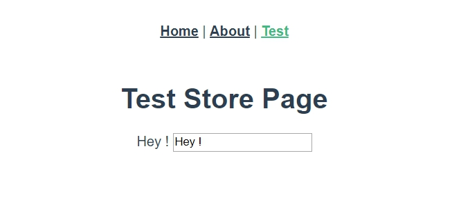

# 非同步的操作 （Store.actions）

<br>

之前在 mutations 的章節提到過，mutations 只允許同步操作，而想要非同步操作的話，必須使用 actions 來做。

Action 類似於 mutation，不同在於：

* Action 提交的是 mutation，而不是直接變更 state。

* Action 支援非同步操作。

<br>

## Store.actions

* 讓我們直接看一個例子 :

    編輯 src/store/index.js 如下 :

    ```js
    export default new Vuex.Store({
        state: {
            msg: 'Hello World',
        },

        mutations: {
            [types.CHANGE_MSG] : (state, newMsg) => {
                state.msg = newMsg
            }
        },

        actions: {
            changeMsg: (context, newMsg) => {
                context.commit(types.CHANGE_MSG, newMsg)
            }
        }
    });
    ```

    <br>

    我們在 actions 區塊中定義了一個名為 `changeMsg` 的 action，其中定義的第一個參數 `context` 是一個 `ActionContext` 介面，其中包含了一些屬性如下 :

    ```js
    // vue.js: source code
    export interface ActionContext<S, R> {
        dispatch: Dispatch; // 可調用其他 action
        commit: Commit;  // 可發起對 mutation 的 commit
        state: S;  // Store.state
        getters: any;  // Store.getters
        rootState: R;  // 當有模組化時才用的到，後面會提到
        rootGetters: any;
    }
    ```

    也就是說，我們可以在 action 中任意使用這些屬性方法。 

    <br>
    <br>

    好了，現在我們實際在 Component 中使用看看吧 : 

    編輯 src/views/TestStore.vue 如下 : 

    ```html
    <template>
        <div>
            <h1>Test Store Page</h1>
                {{msg}}
            <input type="text" v-model="newMsg" v-on:keypress.enter="changeMsg"/>
        </div>
    </template>

    <script>
        export default {
            data () {
                return {
                    newMsg: ''
                }
            },

            methods: {
                changeMsg () {
                    this.$store.dispatch("changeMsg", this.newMsg)
                }
            },

            computed: {
                msg () {
                    return this.$store.state.msg
                }
            }
        }
    </script>
    ```

    注意看 `methods` 區塊，我們定義一個 func 叫 changeMsg，他就是直接使用 this.$store 呼叫 `dispatch` 方法來調用名為 `"changeMsg"` 的Action，並把 `newMsg` 傳遞過去。

    <br>

    實際畫面如下 : 

    

<br>
<br>

## 靈活運用 Actions

* 我們可以使用 payload 的方式向 action 傳遞參數。

    * 首先設計一下 action : 

        ```js
        actions: {
            changeUserInfo: (context, {userName, userAge, userAddr}) => {
                context.commit("updateUserName", userName);
                context.commit("updateUserAge", userAge);
                context.commit("updateUserAddr", userAddr);
            }
        }
        ```

        使用它 : 

        ```js
        const userInfo = {
            userName = "Ben",
            userAge = 33,
            userAddr = "KaohSiung"
        }
        this.$store.dispatch("changeUserInfo", userInfo);
        ```

<br>
<br>

* 前面開頭提到了，actions 是支援非同步處理的，這是 mutations 所做不到的，也是 actions 存在的理由。這邊給一個簡單的小例子示範非同步，下一個章節會用之前我在專案中實現的一個 login 功能實現。

    ```js
    actions: {
        setMsgAsync ({commit}) {
            setTimeout(() => {
                commit('setMsg')
            }, 1000)
        }
    }
    ```

<br>
<br>

* 實際運用，舉一個官方給出的購物車例子 :

    ```js
    actions: {
        checkout ({ commit, state }, products) {
            // 備份購物車
            const savedCartItems = [...state.cart.added]
            // 發出結帳請求，然後樂端的直接清空購物車
            commit(types.CHECKOUT_REQUEST)
            // 購物 API 接受一個成功以及一個失敗的回調函式
            shop.buyProducts(
                products,
                // 成功回調
                () => commit(types.CHECKOUT_SUCCESS),
                // 失敗回調
                () => commit(types.CHECKOUT_FAILURE, savedCartItems)
            )
        }
    }
    ```