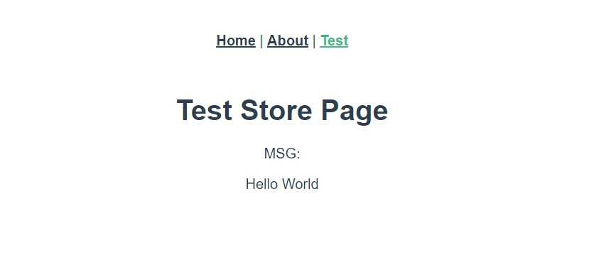

# 寫一個 Hello World 吧 !

<br>

學習任何程式的開頭都少不了寫一個 Hello World，本篇文章就先來寫配置一個基本的 Vuex 應用，並大概介紹一下 Vuex 的結構。 

<br>

## Vuex 設定文件

* 當我們已經安專好 vuex 之後，我們要再 `src/store/` 資料夾下建立一個 index.js 檔案。

    打開 index.js 並編輯如下 : 

    ```js
    import Vue from "vue";
    import Vuex from "vuex";

    Vue.use(Vuex);

    export default new Vuex.Store({
    state: {},
    mutations: {},
    getters: {},
    actions: {},
    modules: {}
    });
    ```

    `Vue.use(Vuex)` 註冊使用 Vuex 不必多說。

    這邊我們可以看到 `Vuex.Store` 物件中出現的五個重要區 : `mutations`、`getters`、`actions`、`modules`，這些在後面會慢慢講到，在這裡我們先學會用 `state` 就好了。

<br>

* 再來要去 src/main.js 裡面把 store 的設定文件註冊到 Vue 物件中。

    編輯 src/main.js 如下 : 

    ```js
    import Vue from "vue";
    import App from "./App.vue";
    import router from "./router";
    import store from "./store";

    Vue.config.productionTip = false;

    new Vue({
        router,  // 註冊 vue-router 的設定
        store,  // 註冊 vuex 的設定
        render: h => h(App)
    }).$mount("#app");
    ```

    這樣一來，我們就可以再任何 Component 中直接使用 `this.$store` 調用 store 的功能了。 

<br>
<br>

## Store.state

先來說一下甚麼是 `state`，這裡沒有甚麼難懂的設計模式或者專有名詞，你可以理解 `state` 就是我們定義的 "__全域變數__" ，不知到這樣有沒有比較懂...

* 我們直接在 `Vuex.Store` 裡定義 `state` :

    ```js
    state: {
        msg: 'Hello World'
    },
    ```

    這樣一來我們就有了一個名為 `msg` 的狀態。目前預設值為 Hello Wolrd。

<br>

* 現在我們就可以在 Component 中叫出 state 來看看拉 : 

    這邊建立一個 Component 名為 `TestStore.vue` 設定 Router path 為 `'/test'`（Router 怎麼配就不多說了，還不知道的先去看前面的筆記），編輯 `TestStore.vue` 如下 : 


    ```html
    <template>
        <div>
            <h1>Test Store Page</h1>

            <label>MSG: </label>
            <p>{{msg}}</p>
        </div>
    </template>

    <script>
        export default {
            computed: {
                msg(){
                    return this.$store.state.msg
                }
            }
        }
    </script>
    ```

    解釋一下，我們宣告一個 `computed` 參數: `msg`，當 store 中定義的 `state.msg` 一有變動時，`msg` 也一起改變。

    <br>

    如果沒有發生意外，畫面應該如下 : 

    

    <br>

    以上就是本章內容。