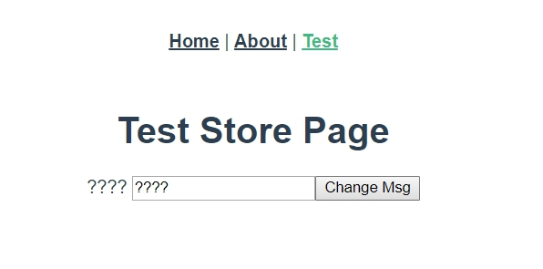

# 進入模組化前暫時總結

<br>

到目前為止，我們基本上已經講完了所有 Vuex 的功能，其實主要可以劃分成四個部分 :

* __`Store.state`__ : 管理 Vuex 的所有狀態

* __`Store.mutations`__ : 可以提交 commit 來改變 state

* __`Store.getters`__ : 可以自訂 get 出需要的 state

* __`Store.actions`__ : 補足 mutations 非同步的問題 （某種意義上的 setters）

<br>

本篇筆記要實際講述一下，在實際的專案中如何更優雅的去編排與使用這些工具。

<br>
<br>

## 使用規範

* 首先要聲明一下，這邊的使用規範並不是必須遵守，這裡的規範是我自己通過寫 code 的經驗累積與看過一些國內外專案架構而訂下的一個規範，當我們寫 code 有一定的好習慣跟規範之後，專案架構也會比較清晰。

* 規範說明 :

    1. __不要在 Components 裡面直接使用 `store.state` 與 `store.commit`。__

        當我們想要提交 commit 修改 state 時，請使用 `action` 來代理執行。當我們需要取出 state 時，請使用 `getter` 來取值。

        <br>

    2. __不要把所有的 `state`、`mutations`、`getters`、`actions` 全部寫在 src/store/index.js 裡面。__

        我們要把 `Vuex.Store` 的屬性們拆分到不同文件，這個待會實際來操作一次。

        <br>

    3. __在 Components 中使用 `actions` 與 `getters` 時，要使用 `mapActions` 與 `mapGetters` 來註冊方法。__

        不要再 Components 中出現 `store.dispatch` 與 `store.getters`，我們就直接用輔助函式來映射成為 Components 方法。

<br>
<br>

## Vuex.Store 拆分文件

* 上面的 __規範 2__ 提到了拆分 `Vuex.Store`，所以這邊就示範一下如何來拆解分文件。

    首先，我們來看一下一個基本的 `Vuex.Store` 的結構 :

    ```js
    export default new Vuex.Store({
        state: {},
        mutations: {},
        getters: {},
        actions: {}
    });
    ```

    所以目前我們看起來需要拆分成 4 個文件，那這邊我們一個一個來建立文件吧 :

    <br>


* 建立文件 __state.js__ 如下 : 

    src/store/state.js :

    ```js
    const state = {
        msg: 'Hello World!'
    };

    export default state
    ```

    再回來看看 src/store/index.js :

    ```js
    import Vue from "vue";
    import Vuex from "vuex";
    import state from "@/store/state";

    Vue.use(Vuex);

    export default new Vuex.Store({
        state,  // import state 後直接放在這邊就好
        mutations: {},
        getters: {},
        actions: {}
    })
    ```

    <br>
    <br>

* 建立 __mutation_types.js__ 如下 :

    src/store/mutation_types.js :

    ```js
    // mutation-types.js
    export const CHANGE_MSG = 'changeMsg';
    ```

    這邊建立 mutation_types 的目的前面章節已經解釋過了，還不清楚的同學請回到 [__更好的設計與使用 mutations__](../../vuex/mutations-improve/README.md) 章節查看。

    <br>
    <br>

* 建立 __mutations.js__ 如下 : 

    src/store/mutations.js :

    ```js
    import * as types from './mutation-types'

    // Mutation 裡面的方法必須是同步的
    const mutations = {
        [types.CHANGE_MSG] (state, newMsg) {
            state.msg = newMsg
        },
    };

    export default mutations
    ```

    <br>
    <br>

* 我們再回來看一下 src/store/index.js : 

    ```js
    import Vue from "vue";
    import Vuex from "vuex";
    import state from "@/store/state";
    import mutations from "@/store/mutations";

    Vue.use(Vuex);

    export default new Vuex.Store({
        state,  
        mutations,  // import mutations 後直接放在這邊就好
        getters: {},
        actions: {}
    })
    ```

    <br>
    <br>

* 建立 __getters.js__ 如下 : 

    src/store/getters.js :

    ```js
    const currentMsg = state => state.msg;

    const getters = {
        currentMsg,
    };

    export default getters
    ```

    <br>
    <br>

* 我們再回來看一下 src/store/index.js : 

    ```js
    import Vue from "vue";
    import Vuex from "vuex";
    import state from "@/store/state";
    import mutations from "@/store/mutations";
    import getters from "@/store/getters";

    Vue.use(Vuex);

    export default new Vuex.Store({
        state,  
        mutations,  
        getters,  // import getters 後直接放在這邊就好
        actions: {}
    })
    ```

    <br>
    <br>

* 建立 __actions.js__ 如下 : 

    src/store/actions.js :

    ```js
    import * as types from './mutation-types'


    const changeMsg = (context, newMsg) => {
        context.commit(types.CHANGE_MSG, newMsg)
    };

    const actions = {
        changeMsg,
    };

    export default actions
    ```

    <br>
    <br>

* 最後來看看 src/store/index.js : 

    ```js
    import Vue from "vue";
    import Vuex from "vuex";
    import state from "@/store/state";
    import mutations from "@/store/mutations";
    import getters from "@/store/getters";
    import actions from "@/store/actions";

    Vue.use(Vuex);

    export default new Vuex.Store({
        state,  
        mutations,  
        getters,
        actions  // import actions 後直接放在這邊就好
    })
    ```

    <br>

    到目前為止，我們已經把 `Vuex.Store` 拆分好了，我們到實際的 Components 裡面測試一下吧。

    <br>
    <br>

* 實際測試，重購 TestStore.vue :

    src/views/TestStore.vue : 

    ```html
    <template>
        <div>
            <h1>Test Store Page</h1>
            {{msg}}
            <input type="text" v-model="newMsg"/>
            <button @click="changeMsg(newMsg)">Change Msg</button>
        </div>
    </template>

    <script>
        import {mapActions, mapGetters} from 'vuex'

        export default {
            data () {
                return {
                    newMsg: ''
                }
            },

            methods: {
                ...mapActions({
                    changeMsg: "changeMsg"
                }),
            },

            computed: {
                ...mapGetters({
                    msg: "currentMsg"
                })
            }
        }
    </script>
    ```

    <br>

    像我們前面提到過的，在 Components 中不會出現 `$store`，我們一律用 `mapGetters`與 `mapActions` 來映射方法。getters 註冊成為 `computed`，actions 註冊成為 `methods`。

    現在 Vuex 的架構可以算做一個比較規範的設計了（當然還沒有包括模組化）。最後我們來看一下實際畫面 : 

    <br>

    

    <br>

    接下來就是最終章了，進入 Vuex 模組化。


