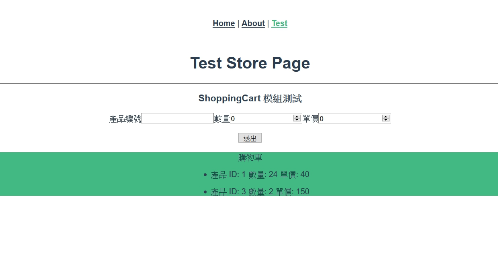
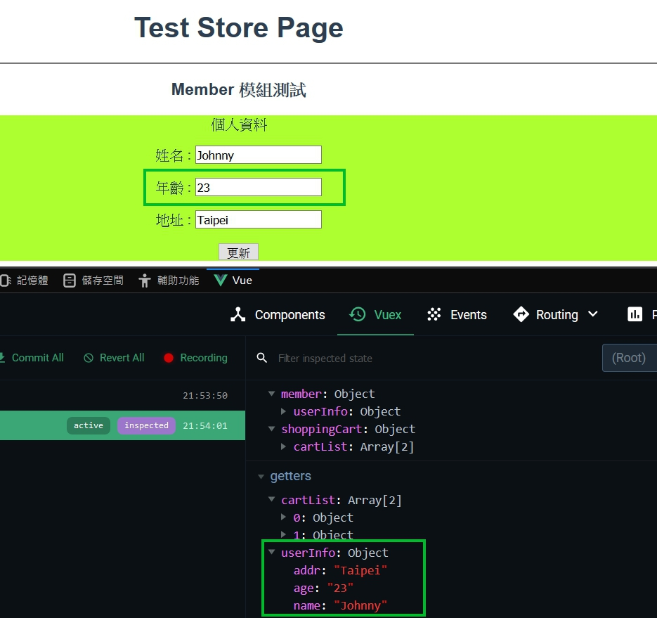

# 正式進入模組化

<br>

好的，終於來到模組化了，Vuex 的部分也差不多進入尾聲了。那我們話不多說，值接開始。

<br>

---

<br>

## 目錄

1. [什麼是模組化](#mdules)

1. [配置 VUEX 模組](#vuexconf)

    * [ShoppingCart 模組](#shoppingcart)

    * [Member 模組](#member)

<br>
<br>

<div id="mdules">

## 什麼是模組化

首先我們要搞清楚什麼是模組化，為什麼需要模組化。我們以開發中遇到的問題為例 :

<br>

* 我們的專案有 3 個模快需要用到 Vuex，分別為 __"購物車系統"__、__"會員資料系統"__、__"訂單系統"__，試想一下，今天有 3 個這樣的模快需要建立 state、mutations、getters、actions。或許你會說還好啦，我在一個檔案中很好的管控我的 code，不會亂掉。那麼如果今天有 10 個模快呢 ? 20 個呢 ?

<br>

* 遇到上面敘述的問題，顯然我們上一個章節的切割 Store 的做法已經無法滿足我們的需求了，這個時候就需要使用到模組化了。

<br>

* 當我們使用了 Vuex 模組化，我們就可以把各個不同的系統需要的 Vuex 配置文件分類到不同的資料夾中，而且彼此之間也可以呼叫對方模組的方法使用。更方便我們對 code 的管控，以及釐清整個專案架構。

<br>
<br>
<br>
<br>

<div id="vuexconf">

## 配置 VUEX 模組

* 假設我們目前的需求只有 2 個模組，一個是 __"購物車系統"__ 另一個是 __"會員資料系統"__。以下是在同一個文件中呈現配置關係 :

    src/store/index.js:

    ```js
    import Vue from "vue";
    import Vuex from "vuex";

    Vue.use(Vuex);

    const shoppingCart = {
        state: {},
        mutations: {},
        actions: {},
        getters: {}
    }

    const member = {
        state: {},
        mutations: {},
        actions: {},
        getters: {}
    }

    export default new Vuex.Store({
        modules: {
            shoppingCart: shoppingCart,
            member: member
        }
    });
    ```

    其實這樣我們已經配置好模組了，只是並沒有拆分文件而已。由於章節篇幅問題，切分文件留到下一篇再講。

    現在就讓我們慢慢來再這一份文件中配置我們的模組吧 ! 

<br>
<br>

<div id="shoppingcart">

* __ShoppingCart__ 模組

    我們的 shoppingCart 以最簡為例，只需要陣列形式來保存 __產品編號（itemId）__、__數量（count）__、__單價（price）__　即可。

    <br>

    先來看看 shoppingCart 模組建構內容吧 :

    ```js
    const shoppingCart = {
        state: {
            cartList:[] // 用來存放品項的陣列
        },

        mutations: {
            addItemToCart (state, item) {  // 可以通過 commit 一次新增一個 item
                state.cartList.push(item)
            }
        },

        getters: {
            cartList: (state) => state.cartList
        },

        actions: {
            addNewItem (context, item) {
                context.commit("addItemToCart", item)
            }
        }
    }
    ```

    <br>

    其實目前看起來都還可以吧，沒什麼問題。配置好後我們來看一下如何在 Components 中使用 :

    <br>

    編輯文件 src/views/TestStore.vue 如下 :

    ```html
    <template>
        <div>
            <h1>Test Store Page</h1>

            <hr>
            <h3>ShoppingCart 模組測試</h3>
            <form>
                <div>
                    <label>產品編號</label>
                    <input type="text" v-model="item.productId">
                    <label>數量</label>
                    <input type="number" v-model.number="item.count">
                    <label>單價</label>
                    <input type="number" v-model.number="item.price">
                </div>
                <br>
                <div>
                    <button type="button" @click="addItem(item)">送出</button>
                </div>
            </form>
            <br>
            <div class="cart">
                <label>購物車</label>
                <ul v-for="(i, index) in cartList" :key="index">
                    <li>產品 ID: {{i.productId}}  數量: {{i.count}}  單價: {{i.price}}</li>
                </ul>
            </div>
        </div>
    </template>

    <script>
        import {mapGetters, mapActions} from 'vuex'
        export default {
            data () {
                return {
                    item: {
                        productId: '',
                        count: 0,
                        price: 0
                    }
                }
            },

            methods: {
                ...mapActions({
                    addItem: "addNewItem"
                })
            },

            computed: {
                ...mapGetters({
                    cartList: "cartList"
                })
            }
        }
    </script>

    <style>
        .cart {
            background-color: #42b983;
        }
    </style>
    ```

    其實在 Components 中的使用上沒有甚麼特別的，跟之前提到的一樣。看一下實際畫面比較好理解 :

    <br>

    

    目前為止我們已經完成了 ShoppingCart 的部分。

    <br>
    <br>

<div id="member">

* __Member__ 模組

    我們的會員模組一樣最簡為例，只要有姓名、年齡、地址這樣就好。

    ```js
    const member = {
        state: {
            userInfo: {
                name: 'Johnny',
                age: '21',
                addr: 'Taipei'
            }
        },

        mutations: {
            setUserInfo (state, userInfo) {
                state.userInfo = userInfo
            }
        },

        actions: {
            updateUserInfo (context, {name, age, addr}) {
                context.commit("setUserInfo", {name, age, addr})
            }
        },

        getters: {
            userInfo: (state) => state.userInfo
        }
    }
    ```

    <br>

    我們再來去 Components 裡面去測試看看吧 : 

    ```html
    <template>
        <div>
            <h1>Test Store Page</h1>

            <hr>
            <h3>Member 模組測試</h3>
            <div class="update">
                <label>個人資料</label>
                <p><label>姓名 :</label> <input type="text" v-model="userInfo.name"></p>
                <p><label>年齡 :</label> <input type="text" v-model="userInfo.age"></p>
                <p><label>地址 :</label> <input type="text" v-model="userInfo.addr"></p>
                <button @click="updateUserInfo(userInfo)">更新</button>
            </div>
        </div>
    </template>

    <script>
        import {mapGetters, mapActions} from 'vuex'
        export default {
            methods: {
                ...mapActions({
                    updateUserInfo: "updateUserInfo"
                })
            },
            computed: {
                ...mapGetters({
                    userInfo: "userInfo"
                })
            }
        }
    </script>

    <style>
        .update {
            background-color: greenyellow;
        }
    </style>
    ```

    <br>

    實際畫面如下 : 

    

    可以看到，我在這邊把年齡從 21 改到 23 之後，Vuex 的狀態確實也跟著改變了。

    code 有點多，但實際上沒有甚麼難點，都算正常。