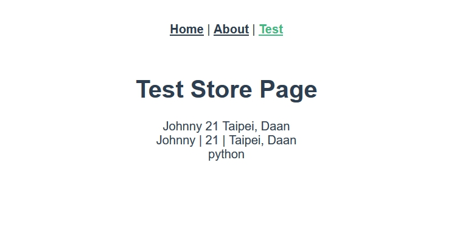

# 更好的取得 state 資訊 （Store.getters）

<br>

getter 的概念，想必寫過 Java 的人一定都知道。但是這邊還是再簡單說一下。所謂 getter，舉個例子就是當我們一個物件中有 `firstName` 與 `lastName` 兩個 Fields，我們想要從物件中取出姓名時，物件可以自動幫我們把姓名整理成 `lastName + firstName`。這個時候就是一個經典的 getter 使用情景。

<br>

## Store.getters

* 現在在我們的 `Store.state` 中加入一個物件 `userInfo` 如下 :

    ```js
    state: {
        userInfo: {
            name: '',
            age: 1,
            addr: '',
        }
    ```

    現在我們有一個叫做 `userInfo` 的物件了，我想要定義 3 個 getters 可以分別取出 `userInfo` 的 `name`、`age`、`addr`。

    <br>

* 繼續編輯 `Store` 物件，在 `state` 區塊後面加入一個新的區塊 `getters` 如下 : 

    ```js
    export default new Vuex.Store({
        state: {
            userInfo: {
                name: 'Johnny',
                age: 21,
                addr: 'Taipei, Daan',
                skills: ['java', 'python', 'js']
            }
        },

        getters: {
            userName: state => state.userInfo.name,

            userAge: state => state.userInfo.age,

            userAddr: state => state.userInfo.addr,

            fullUserInfo: (state, getters) => {
                return `${getters.userName} |
                        ${getters.userAge} |
                        ${getters.userAddr}`
            },

            getSkillsById: (state) => (id) => {
                return state.userInfo.skills[id]
            }
        }
    });
    ```

    其實應該直接可以看得出來前三個 `getters` 在做甚麼，這邊就不多解釋了。
    
    值得留意的是 `fullUserInfo` 與 `getSkillsById` : 
    
    * `fullUserInfo` 宣告時傳入第二個參數 `getters`，可以存取同級的其他 `getters`。

    * `getSkillsById` 透過 index 取得 `skills` 陣列中的元素值。

    <br>
    <br>

* 在 Component 中使用 getters 的方法

    編輯 src/views/TestStore.vue 如下: 

    ```html
    <template>
        <div>
            <h1>Test Store Page</h1>
            <div>
                {{userName}}
                {{userAge}}
                {{userAddr}}
            </div>
            <div>{{userInfo}}</div>
            <div>{{skill(1)}}</div>
        </div>
    </template>

    <script>
        export default {
            computed: {
                userName () {
                    return this.$store.getters.userName
                },
                userAge () {
                    return this.$store.getters.userAge
                },
                userAddr () {
                    return this.$store.getters.userAddr
                },
                userInfo () {
                    return this.$store.getters.fullUserInfo
                },
                skill () {
                    return this.$store.getters.getSkillsById
                }
            }
        }
    </script>
    ```

    <br>

    實際畫面如下 :

    
