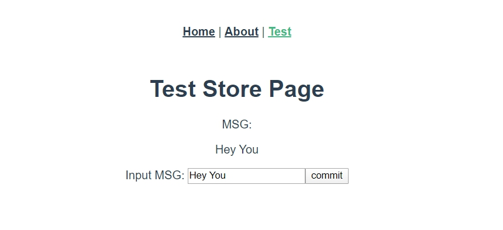

# 改變狀態（Store.mutations）

<br>

在上一章中，我們學到如何設定與使用 `Store.state`，但是還沒有學到如何改變 `Store.state`，所以在這邊我們就來學習如何改變它。

<br>

## Store.mutations

* 要改變 `Store.state`，不是簡單直白的 : 

    ```js
    this.$store.state.msg = 'Hey You';
    ```

    而是要向 `Store` 以提交 commit 的方式來更新 state 的值。為甚麼 Vuex 要這樣設計呢，原因就是這樣一來 Vuex 就可以追蹤 Store 狀態改變的這個事件。通過追蹤 commit 事件，Vuex 在背後可以幫我們做很多事情。

    <br>

* 更改 `Store` 的唯一方法就是提交 mutation。所以我們要先建立一個 mutation : 

    src/store/index.js : 

    ```js
    export default new Vuex.Store({
        state: {
            msg: 'Hello World'
        },

        mutations: {
            changeMsg: (state, newMsg) => {
            state.msg = newMsg
            }
        },
    });
    ```

    我們在 mutations 區塊中定義了一個名為 `changeMsg` 的 `mutation handler`，__要注意定義方法的第一個參數一定要是 `state`__。`changeMsg` 稱為這個 `mutation handler` 的 `type`。

    <br>

    現在我們的 `mutation handler` 已經定義好了，但是我們並不能直接在 Components 中直接這樣用 :

    ```js
    this.$store.mutations.changeMsg(...)
    ```

    我們上面定義的方法，更像是在做註冊的動作，當我們需要改變 `state` 時，正確的作法是這樣 :

     ```js
    this.$store.commit("changeMsg", "newMsg")
    ```

    commit 的格式就是 `commit(type, params)`

    <br>
    <br>

## 實作

* 根據上面已經定義好的 Vuex.Store，我們改變一下 TestStore.vue

    編輯 src/views/TestStore.vue 如下 : 

    ```html
    <template>
        <div>
            <h1>Test Store Page</h1>

            <label>MSG: </label>
            <p>{{msg}}</p>

            <label>Input MSG: </label>
            <input type="text" v-model="newMsg">
            <button @click="commitMsg">commit</button>
        </div>
    </template>

    <script>
        export default {
            data() {
            return{
                newMsg: ''
            }
            },

            methods: {
            commitMsg(){
                this.$store.commit("changeMsg", this.newMsg)
            }
            },
            computed: {
                msg(){
                    return this.$store.state.msg
                }
            }
        }
    </script>
    ```

    <br>

    實際畫面如下 : 

    

<br>
<br>

## 注意事項

最後提醒幾點 mutations 的注意事項 : 

* mutations 必須是 __同步__ 函式。如果真的需要做非同步，之後會講到 `actions`，在那一章節會談到如何做非同步處理。


